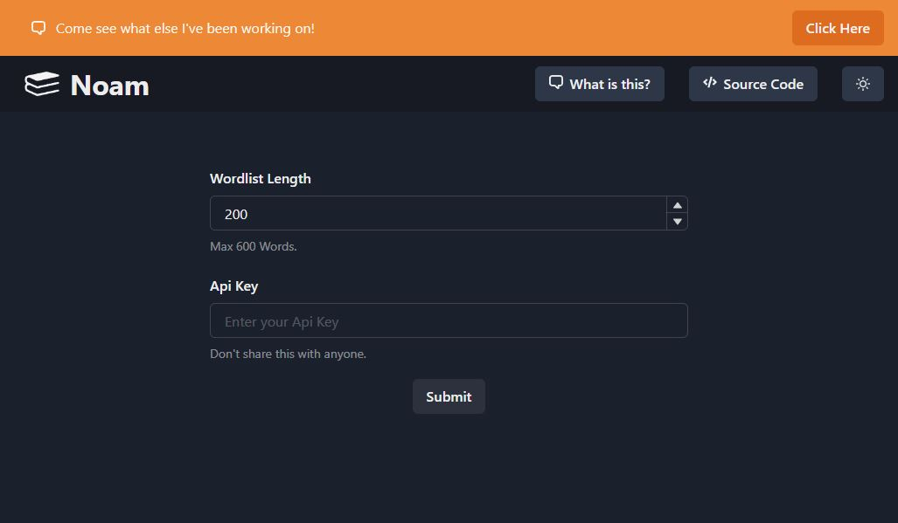

<div align="center">
    

  <h2 align="center">Project Noam</h2>

  <p align="center">
    Word Scrapper - Wordlist Creator
  </p>
</div>

Noam generate wordlists used for spelling bee purposes. It provides a way for spellers to test their spelling skills and improve their vocabulary. It also provides a way for teachers to create wordlists for their students to practice.

Wordlists contain the following categories:

- Words
- Definitions
- Pronunciations
- Parts of Speech
- Sentences
- Etymology

## Getting Started

These instructions will get you a copy of the project up and running on your local machine for development and testing purposes.

### Prerequisites

Node 19.7.0

Python 3.9 or higher

```
apt-get update
apt-get install python
apt-get install nodejs
```

### Installing

A step by step series of examples that tell you how to get a development env running

either pipfile or requirements.txt can be used

```
npm install
pip install requirements.txt
pipenv install
```

Run the following command to start the application

```
npm run start
```

### Usage

This filling out and submitting the form will generate a wordlist in the form of a downloadable spreadsheet.

A Wordlist length must be specified between 1 to 600 words & an Api Key must be provided; Which can be [found here](https://blog.justinjzhang.com/noam).

<center></center>

## Running unit tests

Located in tests folder at _src/test_

- form.test.tsx
- navbar.test.tsx
- promo.test.tsx

```
npm run test
```

## Built With

[]()
[]()
[]()
[]()
[]()
[]()
[]()
[]()
[]()
[]()
[]()
[]()
[]()
[]()
[]()
[]()

## Contributing

If you see an issue or would like to contribute, please do & open a pull request or ticket for/with new features or fixes.

## Authors

- **Justin Zhang** - _Initial work_ - [JustinZhang17](https://github.com/JustinZhang17)

## License

This project is licensed under the MIT License - see the [LICENSE.md](LICENSE.md) file for details
